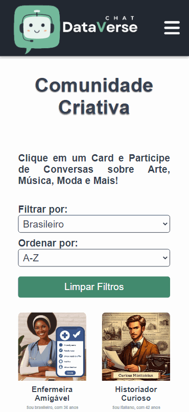
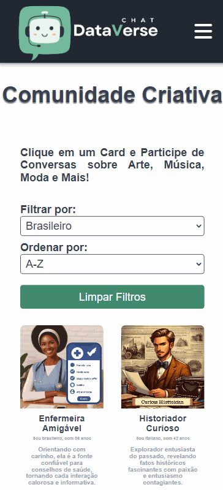
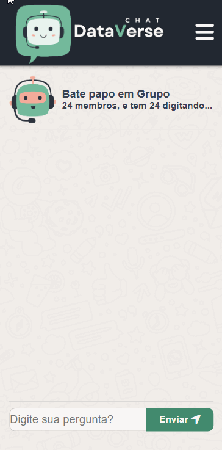
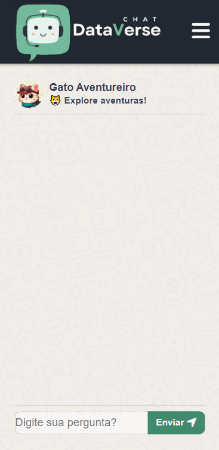

<h1>
    
    Projeto 03 - Dataverse Chat
</h1>

## 📚 Confira meu caderno de estudos:

## 📝 Ferramentas utilizadas no sistema DataverseChat

- [GitHub do Projeto]()
- [Figma - Protótipo do projeto](https://www.figma.com/file/asUYQQBBq3lTGP2og7X0Et/Dataverse-Chat?type=design&node-id=201%3A441&mode=dev&t=5njNnMhiYVumzElG-1)

<table>
  <thead>
    <tr align="left">
      <th>Nº</th>
      <th>Status</th>
      <th>Etapas</th>
      <th>Etapas do Desenvolvimento do Projeto</th>
    </tr>
  </thead>
  <tbody align="left">
    <tr>
      <td>01</td>
      <td></td>
      <td>Marco 01 SPA - Protótipos.</td>
      <td align="center">
        
      </td>
    </tr>
    <tr>
      <td>02</td>
      <td></td>
      <td>Marco 02 DADOS - Vizualização do sistema, funções de filtragem, ordenação e cálculo.</td>
      <td align="center">
        
      </td>
    </tr>
    <tr>
      <td>03</td>
      <td></td>
      <td>Marco 03 API - Conectar com API OpenAI(chat individual).</td>
      <td align="center">
        
      </td>
    </tr>
    <tr>
      <td>04</td>
      <td></td>
      <td>Marco 04 API - Conectar a API OpenAI(chat grupal).</td>
      <td align="center">
        
      </td>
    </tr>
    </tbody>
  <tfoot>
  </tfoot>
</table>

## 📱 Páginas do Mobile

<table>
  <thead>
    <tr align="center">
      <th><h3>Página do Home Mobile</h3></th>
      <th><h3>Componente Modal</h3></th>
    </tr>
  </thead>
  <tbody align="center">
    <tr>
      <td></td>
      <td></td>
    </tr>
  </tbody>
</table>
<table>
  <thead>
    <tr align="center">
      <th><h3>Página do Chat em Grupo Mobile</h3></th>
      <th><h3>Página do Chat Individual Mobile</h3> </th>
    </tr>
  </thead>
  <tbody align="center">
    <tr>
      <td></td>
      <td></td>
    </tr>
  </tbody>
</table>

 

##### Desenvolvido por Elizabete Fabri 💚

