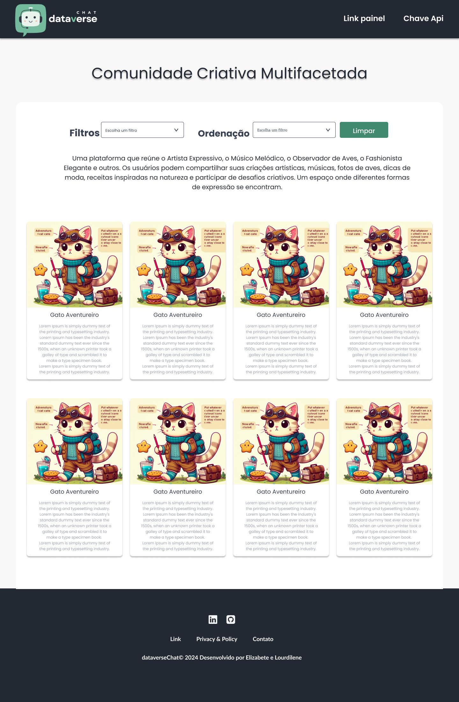
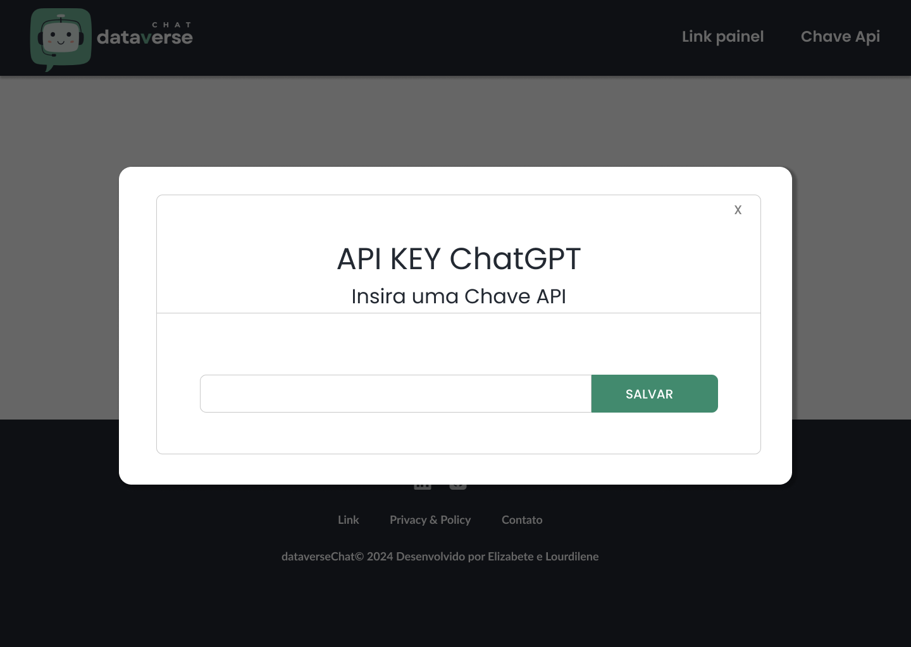
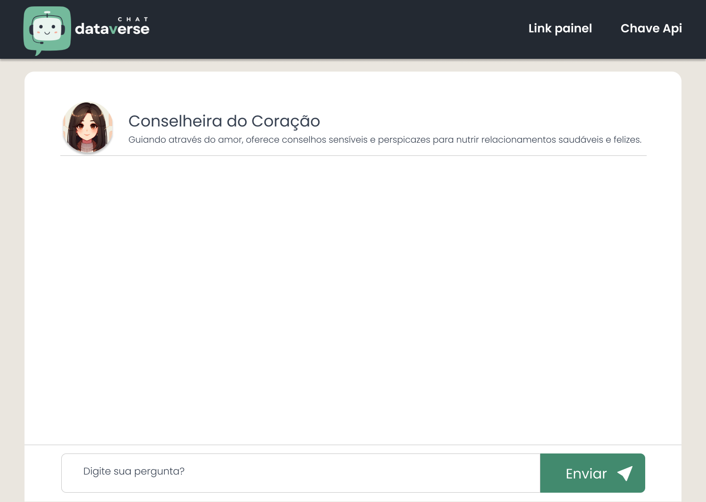
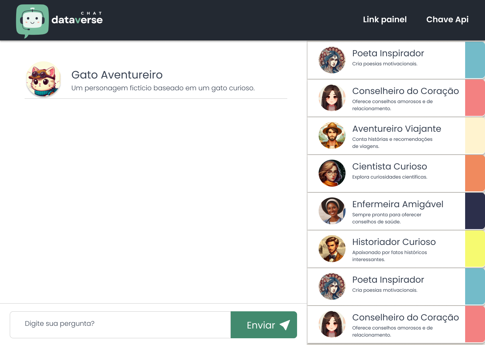
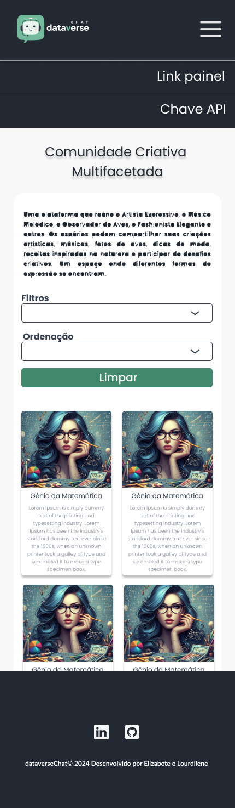

# **MARCO 1:** SPA

Bem-vinda ao primeiro marco do seu aprendizado em JavaScript através de projetos. Neste marco, você começará construindo uma [SPA](https://pt.wikipedia.org/wiki/Aplicativo_de_p%C3%A1gina_%C3%BAnica) (Single Page Application).

## Tarefas deste marco

- [Protótipo de Dataverse](#prototipo-de-dataverse)

### Protótipo de Dataverse desktop Home

### Protótipo de Dataverse componente Modal

### Protótipo de Dataverse desktop bate papo Individual

### Protótipo de Dataverse desktop bate papo em Grupo

### Protótipo de Dataverse desktop Mobile

