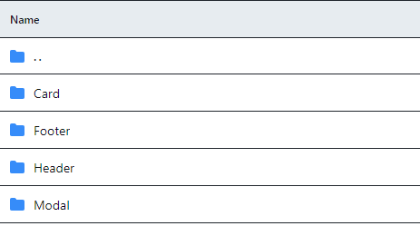

# **MARCO 2:** Visualização de dados
A divisão do código em funções pequenas facilita sua reutilização em projetos diferentes. O objetivo deste marco é fazer com que o Dataverse funcione a 100% dentro da sua SPA, incluindo as funções de filtragem, ordenação e cálculo.

## Tarefas deste marco

- [Organização e Estrutura de Pastas](#organizacao)
- [Desenvolvimento de componentes](#componentes)
- [Migração do conjunto de dados do Dataverse](#conjunto-dados)
- [Reutilização de Funções do Dataverse](#reutilização)
- [Configuração de testes para funções migradas](#testes)
- [Visualizar a page HOME](#visualizar)

### Organização e Estrutura de Pastas
```text
.
├── src
|  ├── components
|  |   └── Card
|  |   └── Footer
|  |   └── Header
|  |   └── Model
|  ├── data
|  |  └── dataset.js
|  ├── images
|  ├── lib
|  |  └── dataFunctions.js
|  |  └── apiKey.js
|  |  └── openAIApi.js
|  ├── styles
|  |  └── global.css
|  ├── test
|  |  └── apiKEy.spec.js
|  |  └── data.js
|  |  └── dataFunctions.spec.js
|  ├── views
|  |  ├── pages
|  |  |  └── Chat
|  |  |  └── Error
|  |  |  └── Grupo
|  ├── index.html
|  ├── index.js
|  ├── router.js
|  └── styleLoader.js
├── README.md
└── package.json
```

### Desenvolvimento de componentes e estrutura.


### Migração do conjunto de dados do Dataverse
``` js
// src/data/dataset.js

export default [
  {
    "id": "marie-curie",
    "name": "Marie Curie",
    "shortDescription": "Física e química, ganhadora de dois Prêmios Nobel.",
    "description": "física e química ...",
    "imageUrl": "https://laboratoria-dataverse-talks.netlify.app/public/marie-curie.jpg",
    "facts": {
      "yearOfBirth": "1867",
      "yearOfDeath": "1934",
      "birthPlace": "Varsóvia, Polônia",
      "mainField": "Física e Química"
    },
    "extraInfo": {
      "imageSource": "https://www.historyextra.com/period/first-world-war/life-of-the-week-marie-curie/"
    }
  },
]
```

### Reutilização de Funções do Dataverse - Adaptado!
```js
// src/lib/fataFuncions.js
export const transformToCamelCase = (param) => {
  const modifiedString = param.replace(/-([a-z])/g, (match, group) =>
    group.toUpperCase()
  );
  return modifiedString;
};

export const sortData = (data, sortBy, sortOrder) => {
  const sortByCamelCase = transformToCamelCase(sortBy);

  const orderedData = data.slice().sort((a, b) => {
    const valueA = a[sortByCamelCase];
    const valueB = b[sortByCamelCase];

    if (sortOrder === "asc") {
      return valueA.localeCompare(valueB);
    }
    return valueB.localeCompare(valueA);
  });

  return orderedData;
};

export const filterData = (data, filterBy, value) => {
  const filterByCamelCase = transformToCamelCase(filterBy);
  const filteredPersonas = data.filter((persona) => {
    return persona.facts[filterByCamelCase] === value;
  });
  return filteredPersonas;
};


```

### Configuração de testes para funções migradas
``` js
// test/dataFunctions.spec.js

import {
  sortData,
  transformToCamelCase,
  filterData,
  // computeStats,
} from "../lib/dataFunctions.js";
import { data as fakeData } from "../test/data.js";

const namesPersonaAsc = [
  "Aventureiro Viajante",
  "Chef Criativo",
  "Enfermeira Amigável",
  "Historiador Curioso",
  "Poeta Inspirador",
];

describe("transformToCamelCase", () => {
  it("transforms kebab-case to camelCase", () => {
    const inputString = "some-example-string";
    const expectedResult = "someExampleString";
    const result = transformToCamelCase(inputString);
    expect(result).toEqual(expectedResult);
  });

  it("transforms another-example-string to anotherExampleString", () => {
    const inputString = "another-example-string";
    const expectedResult = "anotherExampleString";
    const result = transformToCamelCase(inputString);
    expect(result).toEqual(expectedResult);
  });
});

describe("sortData", () => {
  const sortBy = "name";
  const getNames = (personas) => personas.map((persona) => persona.name);

  it("Should return a list sorted in ascending order", () => {
    const sortedData = sortData(fakeData, sortBy, "asc");
    const sortedByName = getNames(sortedData);
    const expectedOrder = namesPersonaAsc;

    expect(sortedByName).toEqual(expectedOrder);
  });

  it("Should return a list sorted in descending order", () => {
    const sortedData = sortData(fakeData, sortBy, "desc");
    const sortedByName = getNames(sortedData);
    const expectedOrder = namesPersonaAsc.reverse();
    expect(sortedByName).toEqual(expectedOrder);
  });
});

describe("filterData", () => {
  const filterBy = "pais-nascimento-persona";
  const expectedValue = 3;
  const getPaisNascimentoPersonas = (personas) =>
    personas.map((persona) => persona.facts.paisNascimentoPersona);
  it("Should return a list filted", () => {
    const filtedData = filterData(fakeData, filterBy, "italiano");
    const filteredByPaisNascimentoPersona =
      getPaisNascimentoPersonas(filtedData);
    const count = filteredByPaisNascimentoPersona.length;
    expect(count).toEqual(expectedValue);
  });
});


```

### 💻 Visualizar a page HOME
``` js
// src/views/Home.js

import { data } from '../data/dataset.js';
import { filterData } from '../lib/dataFunctions.js';

export function Home(props) {
  const viewEl = document.createElement('div');
  //Inicio da Criação da Página Home
  viewEl.innerHTML = `
    <h1>DataVerse</h1>
    ...
  `;
  return viewEl;
}
```
### 💻 Imagem da HOME


<br>

##### Desenvolvido por <span>Elizabete Fabri</span> 💚
