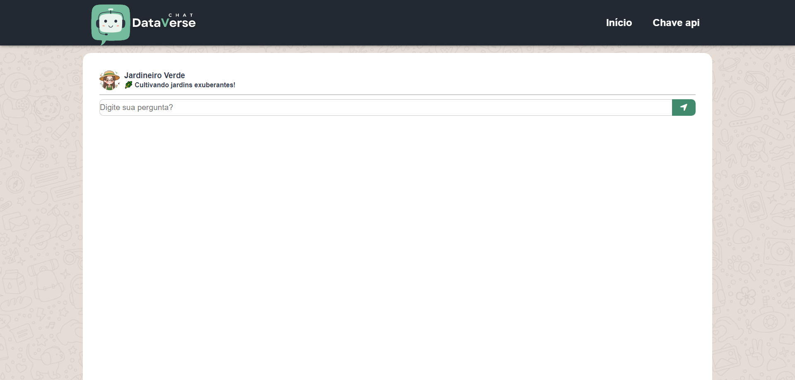
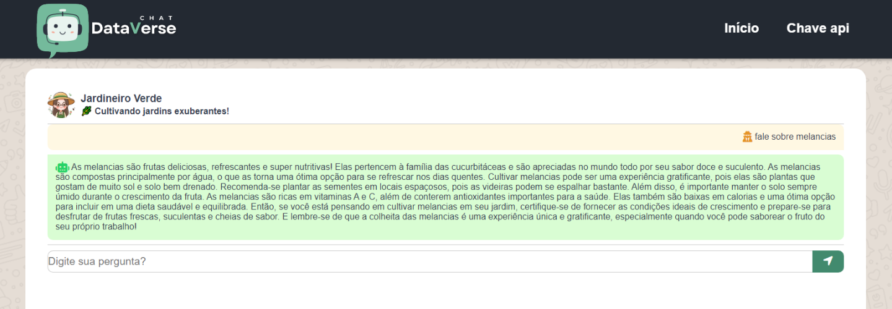

# **MARCO 3:** Conectar a API OpenAI (chat individual)

Armazenar de forma segura sua chave de API e garantir que nosso aplicativo se conecte de forma eficaz à API OpenAI são o cerne deste marco.

## Tarefas deste marco
- [Desenvolvimento da Página de Chat Individual](#pagina-individual)
- [Estilização da página Chat Individual - Mobile First](#mobile-first)
- [Desenvolvimento da Página de Erro](#pagina-individual)
- [Estilização da página Erro](#estilização-error)
- [Estabelecer a conexão por meio de requisições com a API da OpenAI.](#conexao-openai)
- [Desenvolvimento do Bate Papo de Chat Individual](#papo-individual)

### Desenvolvimento da Página de Chat Individual

### Desenvolvimento da Página de Erro

### Estilização do Chat, e conexão com API

