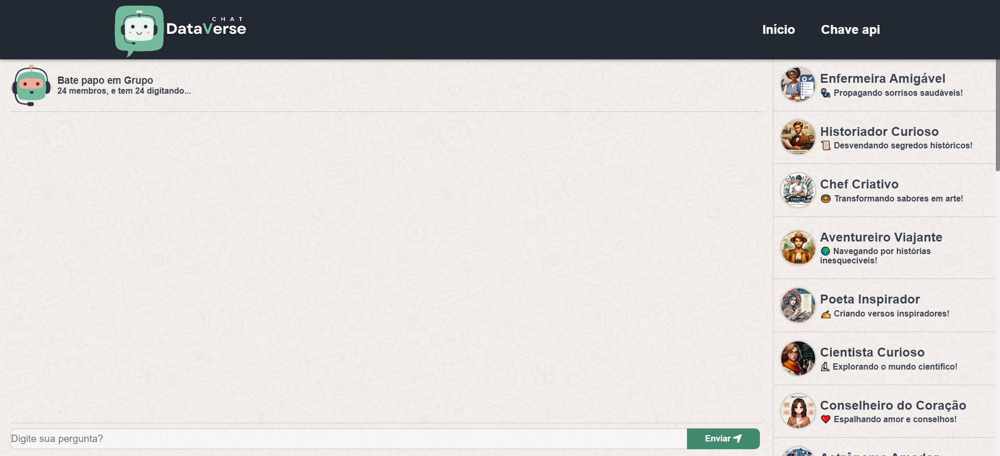
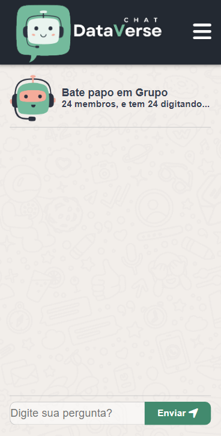

# **MARCO 4:** Conectar a API OpenAI (chat grupal)

O objetivo deste marco é permitir que os usuários interajam com
todos os personagens através de um chat grupal.

## Tarefas deste marco
- [Desenvolvimento da Página de Chat em Grupo](#pagina-individual)
- [Desenvolvimento da página Chat em Grupo - Mobile First](#mobile-first)
- [Estilização da página Chat em Grupo](#estilização-error)
- [Consumo da integração com Open AI](#conexao-openai)
- [Implementação de testes](#papo-individual)

### Desenvolvimento da Página de Chat em Grupo

### Desenvolvimento da página Chat em Grupo Mobile


### Consumo da integração com Open AI
``` js
import { getApiKey } from './apiKey.js';

export const communicateWithOpenAI = async (messages) => {
  const url = 'https://api.openai.com/v1/chat/completions';
  const api_key = getApiKey();

  try {
    const response = await fetch(url, {
      method: 'POST',
      headers: {
        'Content-Type': 'application/json',
        'Authorization': `Bearer ${api_key}`
      },
      body: JSON.stringify({
        model: "gpt-3.5-turbo",
        messages
      })
    });

    if (!response.ok) {
      throw new Error('Failed to fetch');
    }

    const data = await response.json();

    if (data.choices && data.choices.length > 0 && data.choices[0].message) {
      return {
        success: true,
        content: data.choices[0].message.content,
      };
    } else {
      throw new Error('No messages found');
    }
  } catch (error) {
    console.error('Ocorreu um erro:', error);
    throw error;
  }
};

```
### Implementação de testes
``` js
// test/openAIApi.spec.js

import { communicateWithOpenAI } from '../lib/openAIApi.js';

/* eslint-disable */
global.fetch = jest.fn().mockResolvedValue({
  status: 200, json: jest.fn().mockResolvedValue({})
});

describe("communicateWithOpenAI", () => {
  test("A comunicação deve enviar uma solicitação para a API OpenAI e retornar os dados com sucesso!!!", async () => {
    const resposta = { choices: [{ message: { content: 'Esta é uma resposta' } }], ok: true };
    global.fetch.mockResolvedValue({ ok: true, json: jest.fn().mockResolvedValue(resposta) })
    const data = await communicateWithOpenAI("Esta é uma mensagem", {
      id: "1",
    });
    expect(typeof (data)).toEqual('object');
  });
  test("Deve retornar uma mensagem válida da API da OpenAI", async () => {
    const resposta = { choices: [{ message: { content: 'Esta é uma mensagem gerada pela API da OpenAI.' } }], ok: true };
    global.fetch.mockResolvedValue({ ok: true, json: jest.fn().mockResolvedValue(resposta) })
    const data = await communicateWithOpenAI("Esta é uma mensagem", {
      id: "1",
    });
    expect(data.content).toBe('Esta é uma mensagem gerada pela API da OpenAI.');
  });

  it('Deve tratar corretamente a falha na comunicação com a API', async () => {
    global.fetch.mockResolvedValueOnce({
      ok: false,
    });
    await expect(communicateWithOpenAI([])).rejects.toThrow('Failed to fetch');
  });

  it('Deve tratar corretamente o caso de nenhuma mensagem encontrada', async () => {
    global.fetch.mockResolvedValueOnce({
      ok: true,
      json: async () => ({}),
    });
    await expect(communicateWithOpenAI([])).rejects.toThrow('No messages found');
  });
});


```

<br>

##### Desenvolvido por <span>Elizabete Fabri</span> 💚

